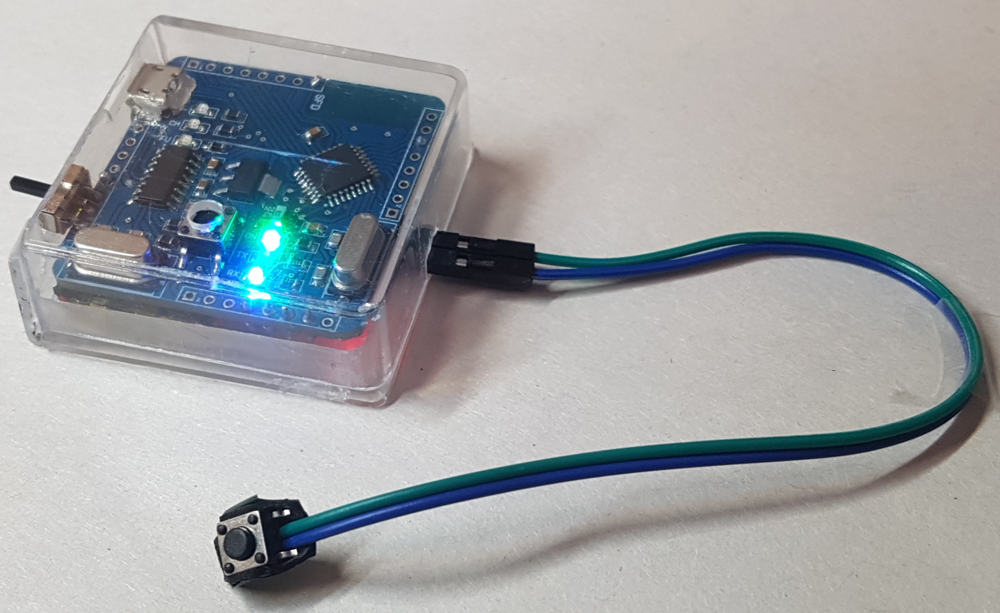
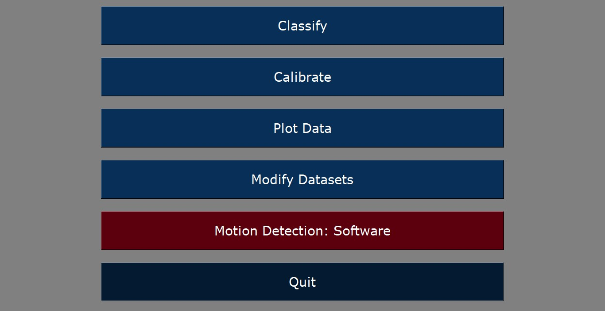
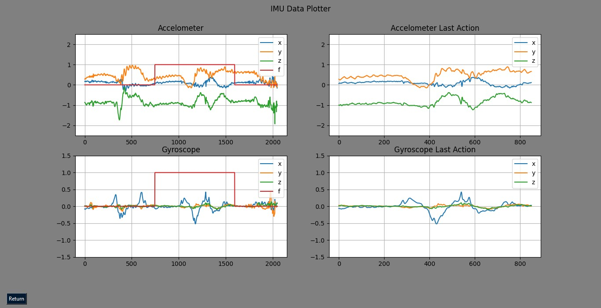

# Motion Classification Using IMU Sensors and Deep Learning

This project aims to design and implement a system that utilizes IMU (Inertial Measurement Unit) sensors and deep learning techniques to recognize various human motions. Applications include air-writing (writing on an imaginary blackboard with the device attached to the back of the hand) and health-related use cases like fall detection for the elderly or patients with mobility issues. The system comprises both hardware and software components working together to detect and classify different types of movements using a neural network.

## Table of Contents
- [Introduction](#introduction)
- [Hardware Design](#hardware-design)
  - [Phase 1: Modular Hardware Implementation](#phase-1-modular-hardware-implementation)
  - [Phase 2: Integrated PCB Design](#phase-2-integrated-pcb-design)
- [Software Design](#software-design)
  - [MPU9250 Class Design](#mpu9250-class-design)
  - [Main Application](#main-application)
  - [Model Training](#model-training)
- [Results](#results)
- [Future Work](#future-work)
- [References](#references)

## Introduction

IMU sensors (Inertial Measurement Units) have been widely used for motion tracking and recognition tasks. These sensors, equipped with accelerometers and gyroscopes, provide real-time data that can be processed using neural networks to classify various human movements. This project focuses on enhancing motion recognition accuracy through deep learning methods.

The project comprises:
- Designing and building the hardware system to capture motion data using IMU sensors and wirelessly transmit it to a central computing unit.
- Developing a neural network model for motion classification.
- Creating an interactive software system with a GUI to visualize classified gestures and modify datasets for model training.

## Hardware Design

### Phase 1: Modular Hardware Implementation

In the initial phase, modular components were set up for the hardware system, including:
- **MPU9250 Module**: A 9-axis IMU sensor that records acceleration and angular velocity.
- **Arduino Nano**: Acts as the primary controller, handling sensor data and communication.
- **Bluetooth Module (HC-05)**: Facilitates wireless communication with the processing unit.
- **Lithium Polymer Battery**: Powers the system with a 3.7V, 300mAh capacity.

### Phase 2: Integrated PCB Design

In the second phase, all components were integrated into a single PCB, reducing system size and improving durability. The PCB design was created using **Altium Designer**, with the final version of the schematic and PCB file located in the **Projects\Altium Projects\Project D** directory. The board design is based on the **Arduino Nano** schematic, and after assembly, the board was flashed with the Arduino bootloader. Key components on the board include:
- **ATMEGA328P-AU**: The microcontroller on the board.
- **MPU9250**: The IMU sensor recording acceleration and angular velocity.
- **Voltage Regulator (3.3V)**: Ensures stable power delivery to all components.
- **CH340G USB-to-Serial Converter**: Enables easy programming and data transfer.
- **TP4056**: Manages the battery's charging and discharging cycles.

> **Note 1**: The Bluetooth module is separate from the main board. Additionally, a push-button is wired to the board to capture user actions. At each time step, the board streams a line of data with the following structure: `acc_x, acc_y, acc_z, gyro_x, gyro_y, gyro_z, hw_flag`

> **Note 2**: The final size of the board is 4 by 4 cm.

  
  

 

  
  

## Software Design

The software is fully implemented in Python and located in the **Codes\python codes** directory, containing four Python files and one Jupyter notebook. Each design component and its corresponding file is described below:

### MPU9250 Class

The project includes a custom Python class that interfaces with the MPU9250 sensor. This class handles Bluetooth communication, data reception, and preprocessing for real-time analysis. It is implemented in the `extension.py` file.

### Main Application

The `app.py` file contains the main application with a graphical user interface (GUI). At startup, it automatically connects to the device, presenting a menu with the following options:

#### Plot Data

A real-time data visualization system that plots received IMU data, allowing monitoring of acceleration and angular velocity changes over time. It also trims data based on the user's last action, detected either by the hardware flag (`hw_flag`) or automatically via software.

#### Modify Datasets

This tool allows users to sample and organize data based on specific movements or gestures. Users can set dataset classes and save or add samples to an existing dataset. After selecting the **Modify Datasets** option, a window appears where users can specify the dataset.

  
  

#### Classify

Upon selecting this option, a window displays all saved trained models in the **Codes\python codes\Models** directory. Users can choose one of the models, and in the newly opened window, predicted gestures are displayed in real time.

  
  

### Model Training

A neural network model, named **AirNet**, was designed and trained on a dataset of 2,170 gestures corresponding to 31 characters (English lowercase letters and some special characters). A Jupyter notebook (`trainer.ipynb`) is provided to facilitate model training. All available model architectures for training should be declared in the `models.py` file.

  
  

 

  
  

## Results

The system achieved an accuracy of **98%** during model evaluation. The confusion matrix and loss/accuracy plots from the training process show consistent improvement, demonstrating a well-trained model. The model effectively detects and classifies various human motions.

  
  

## Future Work

Potential future improvements include:
- **Integration of Transformer Networks**: To analyze and interpret longer sequences of motion data.
- **Fall Detection**: Enhancing the system to detect falls or near-falls by gathering a suitable dataset and designing an appropriate model architecture.

## References
- Amma, Christoph, Marcus Georgi, and Tanja Schultz. "Airwriting: a wearable handwriting recognition system." *Personal and Ubiquitous Computing*, 18 (2014): 191-203.
- Choi, Ahnryul, et al. "Deep learning-based near-fall detection algorithm for fall risk monitoring system using a single inertial measurement unit." *IEEE Transactions on Neural Systems and Rehabilitation Engineering*, 30 (2022): 2385-2394.
